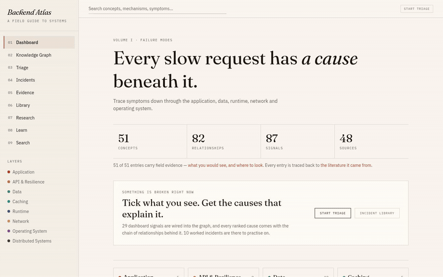
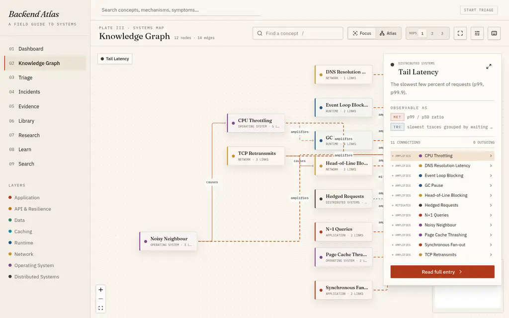
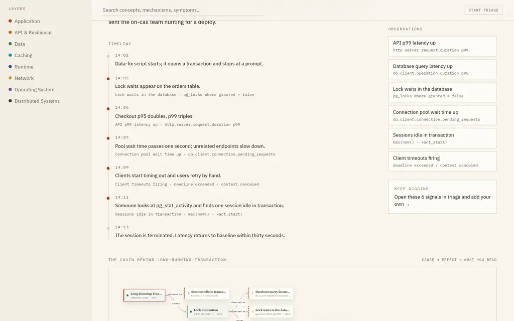
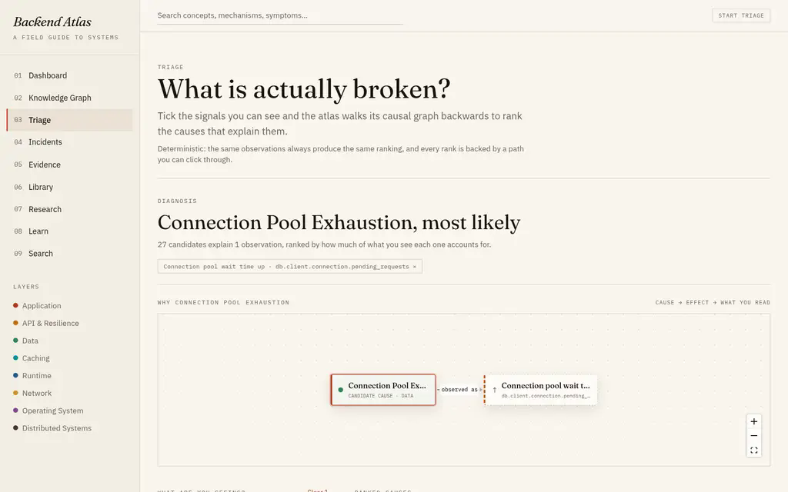
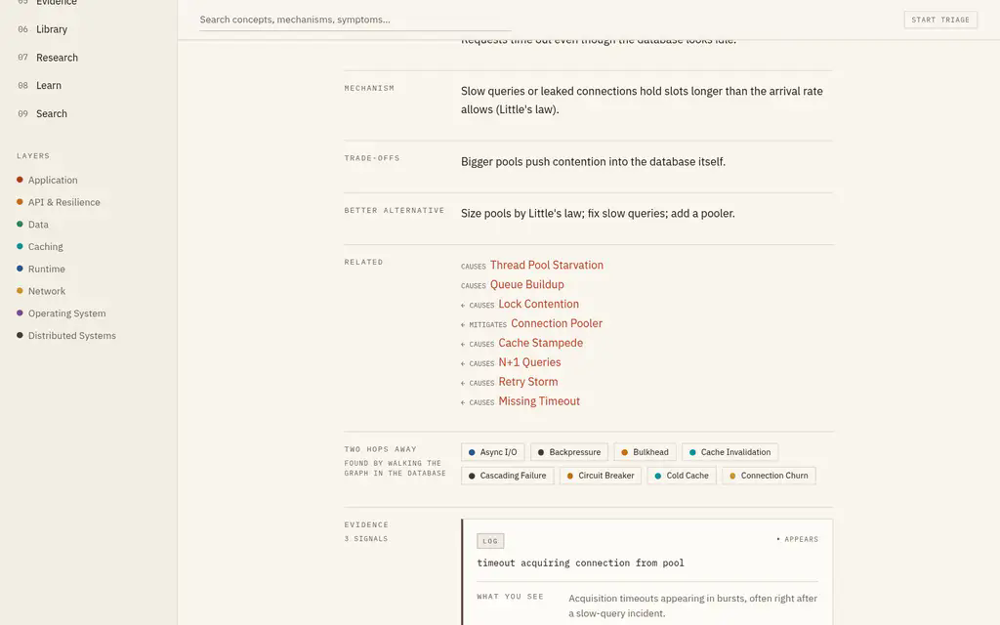
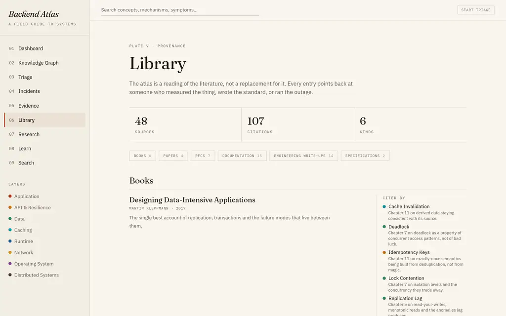
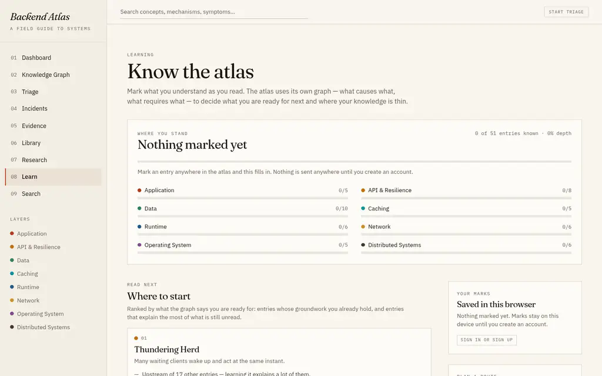
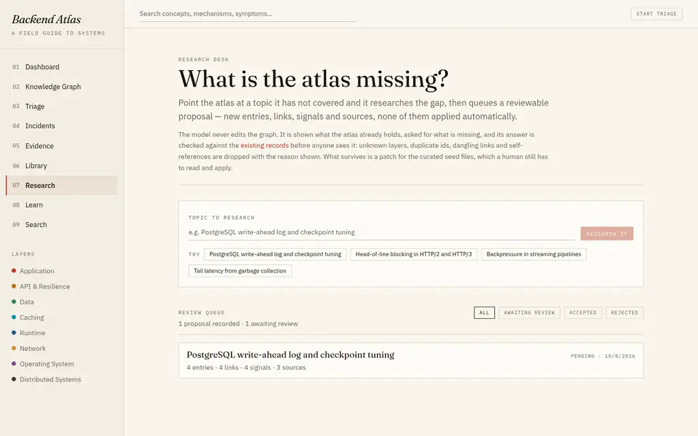

# Backend Atlas (`backendsaga`)

> **A field guide to how backend systems fail, and why.**
>
> 🌐 **Live Production Deployment:** [https://backendsaga.vercel.app](https://backendsaga.vercel.app)

Backend Atlas is an interactive knowledge graph, deterministic incident triage engine, and evidence library for backend systems engineering. It maps real failure modes across the entire stack—from high-level application code down through data stores, runtimes, network boundaries, and operating system internals.

---

## 🎬 Live Interactive Demo

Full end-to-end walkthrough recorded on the live production deployment:



> 📹 *A high-definition H.264 video recording is also available at [`docs/assets/demo.mp4`](docs/assets/demo.mp4).*

---

## 🗺️ Key Features & Visual Walkthrough

### 1. Interactive Knowledge Graph
Explore 50+ concepts and 110+ causal links across 8 architectural layers (Application, API & Resilience, Data, Caching, Runtime, Network, Operating System, Distributed Systems). Graph topology is dynamically calculated using `elkjs` layout derivation inside `@xyflow/react`.



- **Bi-directional inspection:** Click any node to open the inspector card, detailing incoming causes, outgoing amplifiers, and observable signals.
- **Layer filtering:** Focus on specific system tiers to isolate failure boundaries.

---

### 2. Incident Postmortems & Cause-Chain Canvas
10 fully-worked real-world incident scenarios (e.g., *Checkout latency tripled after a routine migration*, *Connection pool exhaustion under failover*).



- **Timeline reconstruction:** Second-by-second timeline connecting timestamped operator actions to emerging symptoms.
- **Visual Cause-Chain Canvas:** Graph-backed DAG tracing the path from root cause (`Long-Running Transaction`) through intermediaries (`Lock Contention`, `Connection Pool Exhaustion`) to user-facing impact (`Client Timeouts`).

---

### 3. Deterministic Incident Triage Engine
Tick observable signals and the engine walks the causal graph backwards to compute the most probable explanations.



- **Deterministic ranking:** Same observations produce the same ranking every time—no hallucinations.
- **Next Checks:** Recommends the exact metrics and queries to confirm or rule out top candidate causes.

---

### 4. Concept Deep-Dives & Evidence Signals
Every concept details the underlying mechanism (e.g., *Little's Law* in connection pools), trade-offs, and better alternatives.



- **Actionable Evidence Cards:** Categorized by OpenTelemetry signal type (`METRIC`, `LOG`, `TRACE`, `PROFILE`, `QUERY_PLAN`, `PACKET`, `OS_COUNTER`).
- **Signal Guidance:** Answers *what you see*, *where to look*, *why it matters*, and *false positives*.

---

### 5. Curated Literature & Provenance Library
Rigorous sourcing from foundational papers, RFCs, standards, and engineering postmortems (Kleppmann, Gregg, Vargo, et al.).



- **Citation tracking:** 48 primary sources linked with specific contextual relevance notes.

---

### 6. Learning Loops & Mastery Tracking
Track your understanding of systems engineering across all layers.



- **Prerequisite-aware study paths:** Highlights foundational concepts before downstream failure modes.
- **Weak-spot discovery:** Identifies gaps in system-level comprehension.

---

### 7. AI Research Console & Review Queue
Grounded AI assistants for concept explanations, outage diagnosis, and gap research.



- **Grounded context:** AI prompts are fed strictly from pure graph context builders.
- **Proposal Review Queue:** AI outputs land in a staging queue for human review and never directly mutate canonical knowledge tables.

---

## 🛠️ Tech Stack

| Tier | Technologies |
|---|---|
| **Framework** | [TanStack Start](https://tanstack.com/start) (Full-stack SSR), [TanStack Router](https://tanstack.com/router), [TanStack Query](https://tanstack.com/query) |
| **Frontend UI** | [React 19](https://react.dev), [Tailwind CSS v4](https://tailwindcss.com), [Radix UI](https://www.radix-ui.com), [Lucide React](https://lucide.dev) |
| **Graph & Canvas** | [@xyflow/react](https://reactflow.dev), [elkjs](https://github.com/kieler/elkjs) |
| **Database & ORM** | [Supabase](https://supabase.com) (PostgreSQL), [Drizzle ORM](https://orm.drizzle.team), [Zod](https://zod.dev) |
| **Server & Deployment** | [Nitro](https://nitro.build) v3 on [Vercel](https://vercel.com) (`nodejs24.x`) |
| **Tooling & Test** | [Bun](https://bun.sh), [Vite](https://vite.dev), [Vitest](https://vitest.dev) |

---

## 🚀 Getting Started

### Prerequisites

- [Bun](https://bun.sh) (v1.2+) or Node.js (v22+)
- A Supabase project (or PostgreSQL instance)

### Local Development

1. **Clone the repository:**
   ```bash
   git clone https://github.com/paramcodes/backendsaga.git
   cd backendsaga
   ```

2. **Install dependencies:**
   ```bash
   bun install
   ```

3. **Configure environment variables:**
   Create a `.env` file in the root directory:
   ```env
   SUPABASE_PROJECT_ID="your-project-id"
   SUPABASE_PUBLISHABLE_KEY="your-supabase-anon-key"
   SUPABASE_URL="https://your-project-id.supabase.co"
   VITE_SUPABASE_PROJECT_ID="your-project-id"
   VITE_SUPABASE_PUBLISHABLE_KEY="your-supabase-anon-key"
   VITE_SUPABASE_URL="https://your-project-id.supabase.co"
   ```

4. **Start the development server:**
   ```bash
   bun run dev
   ```

5. Open [http://localhost:3000](http://localhost:3000) in your browser.

---

## 🧪 Available Scripts

| Command | Description |
|---|---|
| `bun run dev` | Launches the Vite / TanStack Start development server |
| `bun run build` | Builds the client and SSR server bundles for production |
| `bun run preview` | Runs the production build locally |
| `bun run test` | Executes the Vitest test suite (188 tests across 14 suites) |
| `bun run lint` | Lints the codebase with ESLint |
| `bun run format` | Formats all files with Prettier |

---

## 🚢 Deployment

The project is deployed on **Vercel** with Nitro's Vercel build engine:

```bash
# Build for Vercel production
vercel build --prod

# Deploy the prebuilt build artifacts
vercel deploy --prebuilt --prod
```

- **Live URL:** [https://backendsaga.vercel.app](https://backendsaga.vercel.app)
- **Deployment Aliases:** `backendsaga.vercel.app`, `backendsaga-param-codes-projects.vercel.app`
